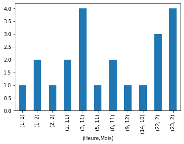

## Exercice 1 : Analyse de données d'observation pièges photo

### Nombre de fiches d'observations : 

Pour ouvrir le fichier selection.json, j'ai utilisé le langage python. J'ai importé les données du fichier **selection.json** dans l'objet **data**. 

```
import json
data = pd.read_json("C:/Users/Marjo/Desktop/tests/selection.json")
data
```

Ce fichier est composé de 9 609 vidéos, cette informations est indiquée à côté de *fileType: MP4*. Dans ces vidéos, il y a 6 026 renards, 1098 loups, 975 bouquetins, 836 blaireaux,  577 fouines et 97 marmottes. 

```
data 
len(data)
```


### Sites avec la plus grande richesse spécifique :

Pour observer les sites les plus riches en faune sauvage, j'ai filtré les données à partir de la colonne *multispecies* de **data**. Il y a 67 vidéos où l'on observe plusieurs espèces. Pour plus facilement observer les caractéristiques de ces données, j'ai créé un filtre pour extraire seulement les lignes où plusieurs espèces étaient présentes. Une fois ces 67 observations extraites, la maille 7 (colonne *path*) a la plus grande richesse spécifique avec la présence de 3 espèces différentes: 4 bouquetins, 1 chamois et 1 marmotte (colonne *comments*). A noter, qu'il y a des vidéos avec des oiseaux et que l'espèce n'est pas spécifiée. Pour obtenir cette information le code suivant a été utilisé : 
```
data["multispecies"].value_counts()
data_mask = data["multispecies"]==1
filter_data = data[data_mask]
```

### Sites les plus riches en faune :

 La maille 7 identifie le plus grand nombre d'individus avec 19 bouquetins observés (vidéos 122 et 134). Ensuite, la maille 38 (vidéos 1257 et 1258) comptent chacune 17 bouquetins. La maille 9 (vidéos 129 à 132 et 1273 à 1276) comptent 9 bouquetins. Ensuite, il y a la maille 6, 51, 66, 21, 39 où l'on observe 5 individus puis la maille 55 qui compte où l'on observe 4 individus. D'autres mailles relèvent ce même nombre d'individus. Ce sont les 12 vidéos qui sont les plus riches en faune. Le code suivant a permis d'obtenir ces informations : 

```
data["population"].value_counts(ascending=True)
values = [11,19,17,9,8,7,6,5,4]
faune = data[data.population.isin(values)]
faune
```

### Les 10 sites avec les plus grand nombre de passages journaliers de loups

La plus grande meute de loups observée est de 7, elles se trouvent dans les mailles 6 et 21 (vidéos 41,42,482,483). La maille 66 (vidéo 4 855) compte 6 loups. Il y a, entre autres, les mailles 7,39,55,70,72,86,87 qui comptent 5 loups. Le code ci-dessous permet d'obtenir les 10 sites où ces observations ont été faites : 

```
data_loup = data["species"]=="loup"
filter_data = data[data_loup]
filter_data["population"].value_counts()
values_loup=[6,7,5]
loup = filter_data[filter_data.population.isin(values_loup)]
loup
```

 
##### Figure 1. Fréquence de passage des loups (ordonnée) en fonction des heures et du mois de l'année (abscisse). 



Les loups seraient principalement passés entre 1 heure et 3 heure du matin, le nombre de passage diminue ensuite. D'autres passages ont aussi été observés entre 22h et 23h. Les passages ont été observés au mois d'octobre, novembre, décembre, janvier et février. 

Le code pour trier et représenter les heures et mois de passages sous-forme d'un histogramme : 

```

data_loup = data["species"]=="loup"
filter_data = data[data_loup]
filter_data["population"].value_counts()
values_loup=[6,7,5]
loup = filter_data[filter_data.population.isin(values_loup)]
loup['Datetime'] = pd.to_datetime(loup['startTime'])

loup["Datetime"].groupby([loup["Datetime"].dt.hour.rename("(Heure"), loup["Datetime"].dt.month.rename("Mois)")]).count().plot(kind="bar")
```
##### Figure 2. Fréquence de passage du sitele plus fréquenté en loup (ordonnée) selon les heures et mois de l'année (abscisse) 


Le site le plus fréquenté observe 7 loups filmés, leur passage a été filmé à 2h du matin pour la maille 21 et 8h du matin pour la maille 6. Toutes ces observations ont été relevés au mois de novembre. 

Le code pour trier et représenter les heures et mois de passages du site le plus fréquenté sous-forme d'un histogramme : 

```
site_loup=[7]
loup_max = filter_data[filter_data.population.isin(site_loup)]
loup_max['Datetime'] = pd.to_datetime(loup_max['startTime'])

loup_max["Datetime"].groupby([loup["Datetime"].dt.hour.rename("(Heure"), loup["Datetime"].dt.month.rename("Mois)")]).count().plot(kind="bar")
```

#### 1.C) 
Pour observer la période à laquelle le site est filmé, il serait possible de trier les sites par mois pour savoir la période de l'année où l'espèce a été vue. 


## Exercice 2 : requête SQL

#### A)

Ecrire une requête SQL postgresql/postgis qui retourne pour chaque maille et chaque jour le nombre de bouquetins distincts qui ont été identifiés sur la maille.

Pour cette question, j'ai utilisé le logiciel DBeaver, j'ai importé le fichier **bouquetins.csv** et j'ai réalisé mes requêtes sur cette table. 

J'ai réalisé uen requête en gardant la latitude et la longitude et une autre requête sans ces deux données. J'ai dû fusionner la table csv obtenue avec le fichier **bouquetins.csv** pour les avoir dans une couche mais cette opération ne semble pas avoir correctement focntionnée. 

Requête en gardant latitude et longitude 

```
SELECT x.* FROM public.bouquetins x

select id_device,
	   latitude,
	   longitude,
	   count(distinct id_gps_data) as num_bouq_maille,
	   to_char(gps_date, 'YYYY-MM-DD') as day 
    from public.bouquetins
    group by id_device, latitude, longitude, day;
```

##### Figure 3. Requête SQL et résultats avec longitude et latitude 


#### A_bis)

```
SELECT x.* FROM public.bouquetins x

select id_device,
	   count(distinct id_gps_data) as num_bouq_maille,
	   to_char(gps_date, 'YYYY-MM-DD') as day 
    from public.bouquetins
    group by id_device, day;
```
##### Figure 4. Requête SQL et résultats sans longitude et latitude 


#### B) 

Ecrire une requête sql qui retourne pour chaque maille le nombre de jours ou au moins 3 bouquetins distincts ont été identifiés sur la maille. 

```
select a.id_device,
	   latitude,
	   longitude,
       count(a.day) as days_amount, 
       sum(a.num_bouq_maille) as total_bouquetins
from(
    select id_device,
	   latitude,
	   longitude,
	   count(distinct id_gps_data) as num_bouq_maille,
	   to_char(gps_date, 'YYYY-MM-DD') as day 
    from public.bouquetins
    group by id_device, latitude, longitude, day) as a
where a.num_bouq_maille >= 3
group by a.id_device, latitude, longitude;

```
##### Figure 5. Requête SQL et résultats sans longitude et latitude 


#### B_bis)

```
select a.id_device,
       count(a.day) as days_amount, 
       sum(a.num_bouq_maille) as total_bouquetins
from(
    select id_device,
	   count(distinct id_gps_data) as num_bouq_maille,
	   to_char(gps_date, 'YYYY-MM-DD') as day 
    from public.bouquetins
    group by id_device, day) as a
where a.num_bouq_maille >= 3
group by a.id_device;
```

##### Figure 6. Requête SQL et résultats sans longitude et latitude 


